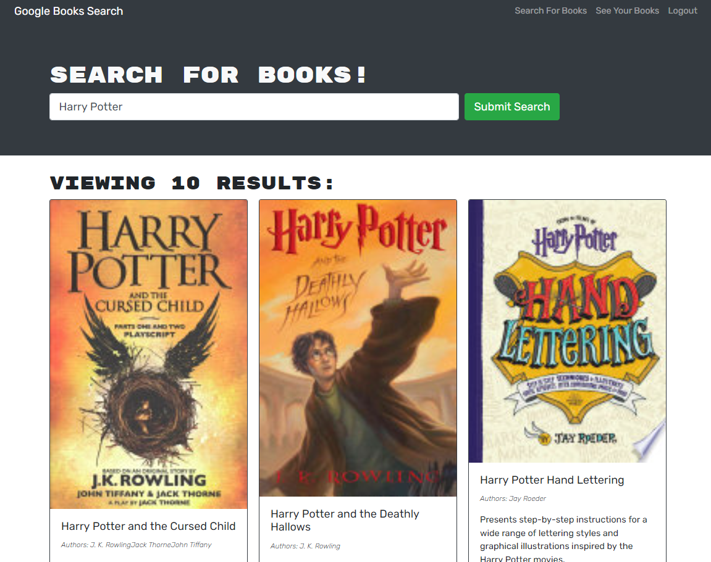
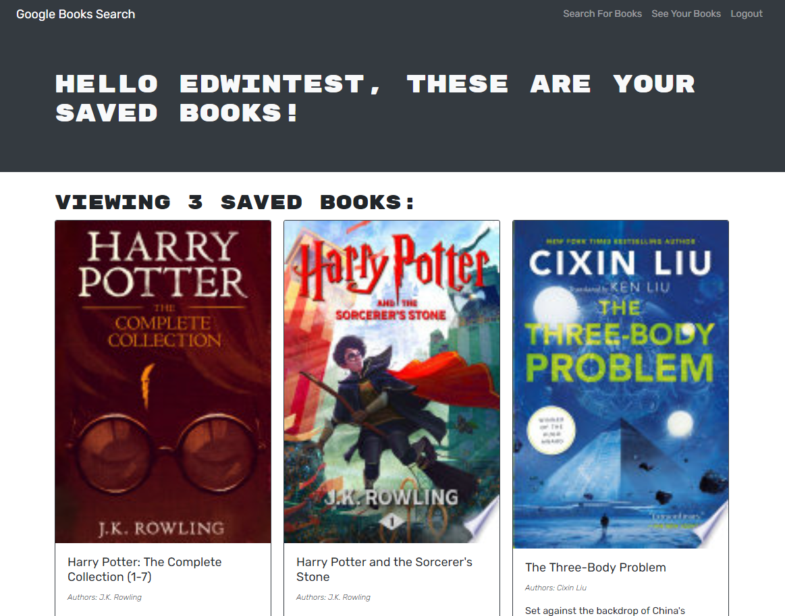

# Book Finder

## About

This app helps users find books and save them for later reading! Specifically, it searches the google engine api for books based on entry in the search bar. Then a user can create an account and save searched books into their list to read later!

You can access this App at: 

## Instructions

The following is a picture of the single page app:

## Credits
Heroku for hosting deployment of the app.
Atlas for hosting database.

## Contact Me

For any questions or additions for this app, contact me at 

https://github.com/Famesmyname/Book-Finder

or email me at edwinfame@yahoo.com

## Version History

1.00    - File Structure Set Up, MVP working on local host
1.01    - Bug fixed regarding Auth and logged in status
1.05    - Deployed on atlas and heroku.